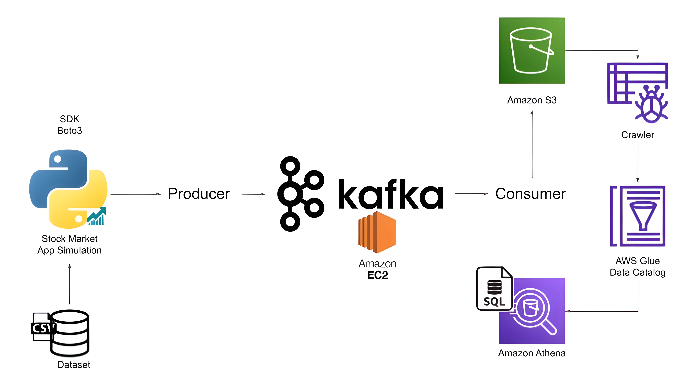

# Real-Time Stock Market Data with Kafka and AWS

Welcome to the "Real-Time Stock Market Data with Kafka and AWS" repository! This project demonstrates how to build a scalable pipeline for real-time stock market data ingestion and processing using Apache Kafka and AWS services like S3.

## Overview

The goal of this project is to stream and process real-time stock market data using Kafka, store the data on AWS S3, and leverage cloud services for scalability and flexibility. The project illustrates how to use Apache Kafka to send data from producers to consumers, while AWS S3 serves as the storage for the processed data.

## Architecture

The architecture consists of the following components:

1. **Kafka Producer**: Reads stock market data from a CSV file and sends it to a Kafka topic.
2. **Kafka Consumer**: Reads data from the Kafka topic and writes it to AWS S3 in JSON format.
3. **AWS S3**: Stores the stock market data for future analysis.
4. **AWS Glue / Athena**: (Optional) Can be used to process and analyze the data in S3.

### Pipeline

Here is a visual representation of the pipeline:

## Technologies

- **Apache Kafka**: A distributed event streaming platform for real-time data processing.
- **AWS S3**: Cloud storage to hold the processed stock market data.
- **Python**: Used for Kafka Producer and Consumer scripts.
- **Jupyter Notebooks**: To provide a step-by-step explanation of Kafka producer and consumer logic.
